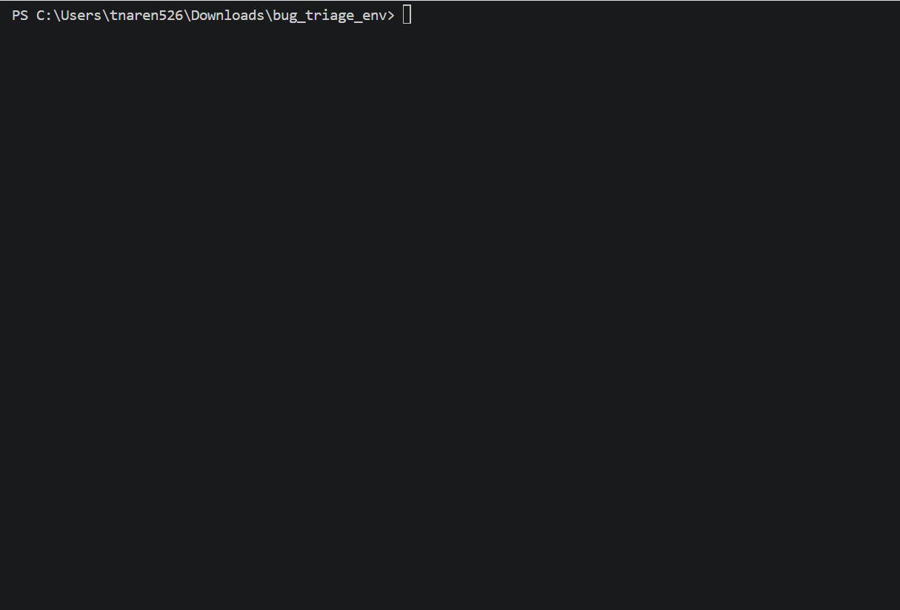

# Bug Triage & Patch Validation — OpenEnv Environment

> **Debugging accounts for roughly half of all developer time.** This environment trains and evaluates AI agents on the full debugging loop: read code, run tests, localise the fault, and submit a correct patch. Unlike static benchmarks, grading is fully live — the test suite actually executes against the submitted patch, so there is no way to fake a pass.



An [OpenEnv](https://huggingface.co/openenv)-compliant environment where an AI agent receives **buggy Python code** with failing unit tests and must **diagnose the root cause**, **identify the faulty line**, and **produce a correct patch**. Grading is fully deterministic — patches are scored by actually running the test suite.

## Why Bug Triage?

| Property | Detail |
|---|---|
| **Real-world relevance** | Debugging is a core engineering skill; models that can triage bugs save developer hours |
| **Deterministic grading** | Tests either pass or they don't — no subjective rubrics, no prompt-gaming |
| **Genuine difficulty** | Requires reading code, understanding intent, reasoning about edge cases, and producing correct patches |
| **Multi-file reasoning** | Two hard scenarios require cross-component reasoning — a class of bug that single-function analysis misses |
| **Scalable** | Easy to add more scenarios without changing graders or environment logic |

## Tasks

| # | Task ID | Name | Difficulty | Max Steps | Description |
|---|---------|------|------------|-----------|-------------|
| 1 | `identify_bug` | Bug Identification | Easy | 5 | Read the code + tests, then report the bug's line number and a description |
| 2 | `fix_bug` | Bug Fix | Medium | 10 | Read the code + tests, then submit a corrected version that passes all tests |
| 3 | `full_triage` | Full Bug Triage | Hard | 15 | Identify the bug **and** submit a correct patch, scored on identification + patch quality + efficiency |

## Scenarios

22 handcrafted bug scenarios across 3 difficulty tiers, including 2 multi-file cross-component scenarios:

### Easy (6 scenarios)
- **off_by_one** — `range(1, n)` skips the first element; should start at `0`
- **wrong_operator** — integer division `//` where float division `/` is needed
- **wrong_return** — `!=` used instead of `==` in a palindrome check
- **wrong_comparison** — `<` used instead of `>` in a clamp upper-bound check
- **missing_return** — function computes the correct result but never returns it
- **wrong_init** — counter initialised to `1` instead of `0`, inflating every result by one

### Medium (7 scenarios)
- **boundary_check** — binary search initialises `high` to `len(arr)` instead of `len(arr) - 1`
- **logic_error** — rate limiter never records allowed timestamps, so it never blocks
- **missing_edge** — list flattener calls `extend(item)` instead of `extend(flatten(item))`
- **wrong_default** — `dict.get(word, 1)` seeds every first-seen word at count 2 instead of 1
- **mutation_bug** — `totals = numbers` aliases the input list, silently mutating the caller's data
- **index_error** — list rotation uses `lst[:k - 1]` instead of `lst[:k]`, dropping the last prefix element
- **sentinel_bug** — returns `-1` instead of `None` when no duplicate is found, breaking `is None` checks

### Hard (7 scenarios)
- **concurrency_bug** — LRU cache `get()` returns the value without promoting the key in access order
- **state_machine** — CSV parser guards the final field append with `if current`, dropping empty trailing fields
- **algorithm_bug** — cycle detection uses a single `visited` set, causing false positives on diamond DAGs
- **scope_bug** — lambda closures in a loop capture `i` by reference; all functions use the last value of `i`
- **memoization_bug** — mutable default argument `cache={}` is shared across all calls to `memoize()`
- **accumulator_bug** — anagram grouper initialises a new group as a bare string instead of `[word]`, breaking `.append()`
- **recursion_bug** — `median()` averages `s[n//2]` and `s[n//2+1]` instead of the two true middle elements

### Multi-file Hard (2 scenarios)
> These scenarios require the agent to reason across **two components in the same file** and find a cross-component inconsistency — a harder class of bug that single-function analysis cannot catch.

- **interface_mismatch** — `Stack.push()` stores key `'val'` but `Stack.peek()` reads key `'value'`; `RPNCalculator` exercises the broken peek path and crashes
- **wrong_delegation** — `EventBus.subscribe()` uppercases the event key but `publish()` looks up the original case; `Notifier` subscribes and publishes but never receives any events

## Action Space

```json
{"tool": "read_code | run_tests | identify_bug | submit_patch", "parameters": {...}}
```

| Tool | Parameters | Description |
|------|-----------|-------------|
| `read_code` | `{"file": "main"}` or `{"file": "test"}` | Read the buggy source or the test file |
| `run_tests` | `{}` | Execute the test suite and get pass/fail results |
| `identify_bug` | `{"line": int, "description": str}` | Report the suspected bug location and root cause |
| `submit_patch` | `{"patched_code": str}` | Submit a complete corrected source file |

## Observation Space

Each step returns a JSON observation with:

| Field | Type | Description |
|-------|------|-------------|
| `scenario_id` | str | Active scenario identifier |
| `difficulty` | str | `easy` / `medium` / `hard` |
| `task_description` | str | Natural-language task prompt |
| `buggy_code` | str | The code containing the bug |
| `file_name` | str | Source file name |
| `test_code` | str | Test suite |
| `last_action_result` | str | Textual feedback from the last tool call |
| `test_results` | list | Per-test pass/fail details |
| `tests_passing` | int | Number of tests currently passing |
| `tests_total` | int | Total tests in the suite |
| `bug_identified` | bool | Whether `identify_bug` has been called |
| `patch_submitted` | bool | Whether `submit_patch` has been called |
| `patch_correct` | bool | Whether the last patch passed all tests |
| `steps_taken` | int | Steps used so far |
| `max_steps` | int | Step budget for this task |
| `steps_remaining` | int | `max_steps - steps_taken` |
| `action_history` | list[str] | Ordered list of all tool calls this episode |
| `error_trace` | str | Error output from the most recent test run or failed patch |
| `patch_attempts` | int | Number of `submit_patch` calls this episode |

## Reward Design

Rewards provide dense signal throughout the trajectory — not just at episode end. The agent is incentivised to follow the correct investigative workflow before submitting a patch.

| Event | Reward |
|-------|--------|
| `read_code` (first call) | +0.01 |
| `run_tests` | +0.02 |
| `identify_bug` — `identify_bug` task (terminal) | grader score × 1.0 |
| `identify_bug` — other tasks (intermediate) | grader score × 0.1 |
| `submit_patch` all tests pass — `fix_bug` | `grade_fix_bug()` (0.85–1.0) |
| `submit_patch` all tests pass — `full_triage` | `grade_full_triage()` (0.0–1.0, includes efficiency) |
| `submit_patch` partial pass | proportional partial credit (0.0–0.85) |
| Unknown tool / missing parameters | −0.05 |
| `full_triage`: patch before reading code or running tests | −0.03 |

## Grading Breakdown (0.0 – 1.0)

### Task 1: `identify_bug`
| Component | Weight |
|-----------|--------|
| Correct line number (exact) | 0.60 |
| Correct line ±1 | 0.30 |
| Keyword overlap with ground-truth description | 0.40 |

### Task 2: `fix_bug`
| Component | Weight |
|-----------|--------|
| Test pass rate | 0.85 |
| Code quality (non-empty, reasonable) | 0.15 |

### Task 3: `full_triage`
| Component | Weight |
|-----------|--------|
| Bug identification score | 0.20 |
| Patch test pass rate | 0.50 |
| Description quality | 0.15 |
| Step efficiency (1 − steps_taken/max_steps) | 0.15 |

## Baseline Scores

### Deterministic oracle agents (no API key required)

Produced by running scripted agents at three capability tiers (see `demo_scores.py`):

| Task | Easy (Oracle) | Medium (Capable) | Hard (Weak) |
|------|:---:|:---:|:---:|
| `identify_bug` | 1.000 | 0.400 | 0.053 |
| `fix_bug` | 1.000 | 0.730 | 0.560 |
| `full_triage` | 0.960 | 0.760 | 0.408 |

**Agent tiers:**
- **Oracle (easy)** — correct line, full description, correct patch in optimal step sequence
- **Capable (medium)** — line off by 2, partial description, near-correct patch (fails 1–3 tests)
- **Weak (hard)** — wrong line, generic description, submits the original buggy code unchanged

> Scores decrease monotonically easy → medium → hard across all tasks, confirming a meaningful difficulty curve.

### LLM baseline (Gemini 2.0 Flash via Google AI Studio)

Real LLM scores from running `inference.py` — see `inference_results.json` for full output.

> Run `inference.py` with your Google AI Studio key to reproduce (see Quick Start below).

## Quick Start

### 1. Install dependencies

```bash
pip install -e ".[dev,inference]"
# or with uv:
uv sync --extra dev --extra inference
```

### 2. Start the server locally

```bash
cd server
uvicorn app:app --host 0.0.0.0 --port 7860
# Server starts at http://localhost:7860
```

### 3. Run deterministic difficulty-curve demo (no API key needed)

```bash
python demo_scores.py
```

### 4. Run LLM baseline inference (Google AI Studio — free)

Get a free key at [aistudio.google.com](https://aistudio.google.com), then:

```bash
export HF_TOKEN="your-google-ai-studio-key"
export API_BASE_URL="https://generativelanguage.googleapis.com/v1beta/openai/"
export MODEL_NAME="gemini-2.0-flash"
export ENV_URL="http://localhost:7860"

python inference.py
```

Results are written to `inference_results.json`.

### 5. Run tests

```bash
pytest tests/ -v   # 44 tests
```

### 6. Validate spec compliance

```bash
openenv validate
```

## Docker Deployment

```bash
# Build from repo root
docker build -t bug-triage-env .
docker run -p 7860:7860 bug-triage-env
# → http://localhost:7860/health
```

## HuggingFace Spaces Deployment

1. Create a new HF Space with **Docker** SDK
2. Push the entire project to the Space repository
3. The `Dockerfile` at repo root configures the Space automatically

> **Note from OpenEnv tutorial-03**: HTTP `/reset` and `/step` are disabled on HF Spaces.  
> All stateful episodes use **WebSocket** (`/ws`) — which is what `inference.py` and the `EnvClient` use automatically.

## API Reference

| Endpoint | Method | Description |
|----------|--------|-------------|
| `/ws` | WebSocket | Persistent stateful session — used by `inference.py` and `EnvClient` |
| `/reset` | POST | Stateless reset (local dev / debug): `{"task_id": "...", "scenario_id": "..."}` |
| `/step` | POST | Stateless step (local dev / debug): `{"action": {"tool": "...", "parameters": {...}}}` |
| `/state` | GET | Current episode metadata (`episode_id`, `step_count`) |
| `/health` | GET | Liveness probe → `{"status": "healthy"}` |
| `/tasks` | GET | List all tasks with difficulty and `max_steps` |

## Project Structure

```
bug_triage_env/
├── models.py              # Pydantic Action / Observation models
├── scenarios.py           # 22 handcrafted bug scenarios (6 easy · 7 medium · 9 hard)
├── graders.py             # 3 deterministic grader functions + TASKS registry
├── client.py              # Typed EnvClient subclass
├── inference.py           # Baseline LLM inference script (OpenAI-compatible client)
├── inference_results.json # Real LLM baseline scores (Gemini 2.0 Flash)
├── demo_scores.py         # Difficulty-curve demo (no LLM or API key required)
├── demo_scores.json       # Deterministic oracle baseline scores
├── openenv.yaml           # OpenEnv manifest
├── pyproject.toml         # Package + [project.scripts] entry point
├── uv.lock                # Locked dependency graph
├── __init__.py
├── Dockerfile             # Container build (repo root — build context is .)
├── server/
│   ├── app.py                      # FastAPI app + custom /tasks endpoint
│   ├── bug_triage_environment.py   # Environment implementation
│   ├── Dockerfile                  # HF Spaces Docker config
│   ├── requirements.txt
│   └── __init__.py
└── tests/
    └── test_environment.py         # 44 unit tests
```

## Environment Variables

| Variable | Required | Default | Description |
|----------|----------|---------|-------------|
| `HF_TOKEN` | Yes (for inference) | — | Google AI Studio / HuggingFace API key |
| `API_BASE_URL` | No | `https://generativelanguage.googleapis.com/v1beta/openai/` | LLM API endpoint |
| `MODEL_NAME` | No | `gemini-2.0-flash` | Model identifier |
| `LOCAL_IMAGE_NAME` | No | — | Local Docker image name (if using `from_docker_image()`) |
| `ENV_URL` | No | `http://localhost:7860` | Bug Triage server URL |

> `demo_scores.py` and all unit tests run without any API key.

## License

MIT
